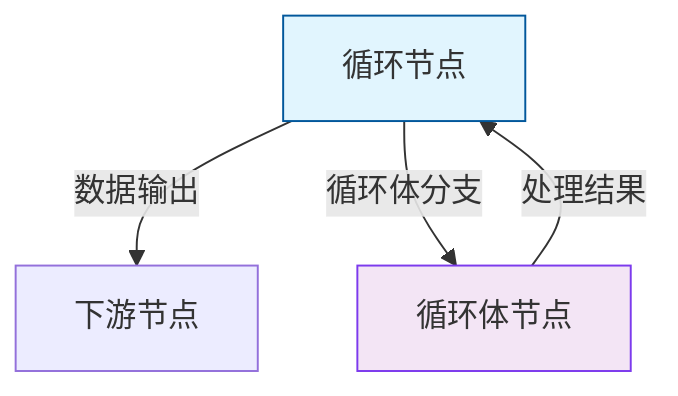

# 工作流编辑器 v2.0 - 架构设计文档

## 🏗️ 总体架构概述

### 核心设计理念
v2.0 版本在保持 v1.0 单父节点架构简洁性的基础上，扩展支持**循环体分支系统**，实现了：
- **数据流** + **控制流** 的统一管理
- **表达式处理** + **分支处理** 的智能切换  
- **简单连接** + **复杂逻辑** 的完美平衡

## 🎯 架构升级要点

### 1. 节点关系模型扩展

#### v1.0 单父节点模式
```typescript
interface Node<T> {
    parentNode?: string; // 单一数据父节点
}
```

#### v2.0 扩展关系模式
```typescript
interface Node<T> {
    parentNode?: string;     // 数据流父节点
    loopBodyNode?: string;   // 循环体子节点（仅循环节点）
    loopContext?: LoopExecutionContext; // 循环上下文
    isLoopBodyNode?: boolean; // 标记为循环体节点
}
```

### 2. 连接类型分层

#### 连接类型枚举
```typescript
export type NodeRelationType = 'data' | 'loopBody';
```

#### 视觉区分策略
- **数据连接**: 蓝色实线 → 表示数据传递
- **循环体连接**: 紫色虚线 + 标签 → 表示控制流分支

### 3. 执行上下文增强

#### 新增循环体方法
```typescript
interface ExecutionContext {
    // 原有方法...
    getLoopBodyNode?: (loopNodeId: string) => Promise<Node<any> | null>;
    executeLoopBody?: (loopNodeId: string, loopBodyNode: Node<any>, element: any, index: number, array: any[]) => Promise<any>;
}
```

## 🔄 循环体分支系统

### 工作原理

#### 1. 连接建立


#### 2. 执行流程
```typescript
// 伪代码展示执行逻辑
async executeLoop(inputArray, nodeData, context) {
    const hasLoopBodyBranch = await context.getLoopBodyNode(nodeId);
    
    for (let i = 0; i < inputArray.length; i++) {
        const element = inputArray[i];
        
        if (hasLoopBodyBranch) {
            // 使用分支处理
            result = await context.executeLoopBody(nodeId, loopBodyNode, element, i, inputArray);
        } else {
            // 使用表达式处理
            result = await processExpression(element, i, inputArray, expression);
        }
        
        collectResult(result);
    }
}
```

### 循环上下文传递

#### 上下文数据结构
```typescript
interface LoopExecutionContext {
    element: any;       // 当前循环元素
    index: number;      // 循环索引
    array: any[];       // 完整数组
    loopNodeId: string; // 循环节点ID
}
```

#### 数据映射策略
```typescript
// 循环体节点的输入数据映射
if (node.isLoopBodyNode && node.loopContext) {
    inputs.element = node.loopContext.element;    // 当前元素
    inputs.index = node.loopContext.index;        // 索引
    inputs.array = node.loopContext.array;        // 整个数组
    inputs.input = node.loopContext.element;      // 默认输入
}
```

## 🎨 UI/UX 设计升级

### 1. GeneralNodeWrapper 增强

#### 新增循环体输出支持
```typescript
interface GeneralNodeWrapperProps {
    hasLoopBodyOutput?: boolean; // 循环体输出连接点
}

// 循环体连接点样式
<Handle
    type="source"
    position={Position.Bottom}
    id="loop-body"
    className="purple-gradient-handle"
/>
```

### 2. 连接识别系统

#### 连接处理逻辑
```typescript
const onConnect = (params) => {
    const isLoopBodyConnection = params.sourceHandle === 'loop-body';
    
    if (isLoopBodyConnection) {
        // 设置循环体关系
        targetNode.isLoopBodyNode = true;
        sourceNode.loopBodyNode = targetNode.id;
    } else {
        // 设置数据流关系  
        targetNode.parentNode = sourceNode.id;
    }
};
```

### 3. 视觉反馈系统

#### 连接样式差异化
```typescript
const edgeStyle = {
    stroke: isLoopBodyConnection ? '#7c3aed' : '#4f46e5',
    strokeDasharray: isLoopBodyConnection ? '5,5' : undefined,
    label: isLoopBodyConnection ? '循环体' : undefined
};
```

## ⚡ 性能优化策略

### 1. 执行顺序优化

#### v1.0: 复杂拓扑排序
```typescript
// 需要构建邻接表、计算入度、拓扑排序
private buildExecutionOrder(nodes, edges) {
    // ~80行复杂逻辑
}
```

#### v2.0: 简化递归构建
```typescript
// 基于父子关系的直接递归
private buildExecutionOrder(nodes) {
    const buildChainFromNode = (nodeId) => {
        if (node.parentNode) buildChainFromNode(node.parentNode);
        result.push(node);
    };
    // ~30行简洁逻辑
}
```

### 2. 数据传递优化

#### 直接父子访问
```typescript
// v2.0: O(1) 直接访问
const parentResult = this.nodeResults.get(node.parentNode);
```

#### 循环上下文缓存
```typescript
// 避免重复创建上下文对象
const loopContext = createLoopContext(element, index, array);
node.loopContext = loopContext; // 缓存复用
```

### 3. 内存管理

#### 上下文生命周期
- **创建**: 循环开始时为每个元素创建
- **传递**: 通过节点引用传递，避免深拷贝
- **清理**: 循环结束后自动释放

## 🔒 类型安全设计

### 严格类型定义
```typescript
// 循环体执行方法的类型安全
executeLoopBody(
    loopNode: Node<any>,
    loopBodyNode: Node<any>, 
    element: any,
    index: number,
    array: any[]
): Promise<any>
```

### 运行时检查
```typescript
// 运行时验证循环体节点状态
if (!node.isLoopBodyNode || !node.loopContext) {
    throw new Error('Invalid loop body node state');
}
```

## 🔄 兼容性保证

### 向后兼容策略

#### 1. 表达式回退
```typescript
// 无分支时自动回退到表达式模式
if (!hasLoopBodyBranch) {
    return await processExpression(element, expression);
}
```

#### 2. 数据结构兼容
```typescript
// 可选字段设计，不影响现有数据
interface Node<T> {
    loopBodyNode?: string;      // 可选
    loopContext?: LoopExecutionContext; // 可选
    isLoopBodyNode?: boolean;   // 可选
}
```

#### 3. API兼容
```typescript
// 新方法都是可选的，不破坏现有接口
interface ExecutionContext {
    getLoopBodyNode?: (...) => Promise<...>;
    executeLoopBody?: (...) => Promise<...>;
}
```

## 🚀 扩展性设计

### 1. 插件化架构
```typescript
// 支持自定义循环处理器
interface LoopProcessor {
    processElement(element: any, context: LoopContext): Promise<any>;
}
```

### 2. 嵌套循环支持
```typescript
// 为未来嵌套循环预留空间
interface LoopExecutionContext {
    nestedLevel?: number;
    parentLoopContext?: LoopExecutionContext;
}
```

### 3. 自定义循环模式
```typescript
// 扩展循环类型
type LoopType = 'forEach' | 'map' | 'filter' | 'reduce' | 'custom';
```

## 📊 监控与调试

### 1. 执行追踪
```typescript
// 详细的循环执行日志
context.logger?.info(`循环体执行: element=${element}, index=${index}`);
```

### 2. 性能监控
```typescript
// 循环性能统计
const startTime = performance.now();
const result = await executeLoopBody(...);
const duration = performance.now() - startTime;
```

### 3. 错误处理
```typescript
// 分层错误处理
try {
    await executeLoopBody(...);
} catch (error) {
    throw new LoopBodyExecutionError(`第 ${index} 项处理失败: ${error}`);
}
```

## 🎯 最佳实践

### 1. 循环体设计原则
- **单一职责**: 每个循环体专注处理单个元素
- **无副作用**: 避免修改外部状态
- **错误隔离**: 单个元素错误不影响整体流程

### 2. 性能优化建议
- **批处理**: 对于大数组考虑分批处理
- **并行处理**: 未来版本可考虑并行执行循环体
- **内存控制**: 合理设置 `maxIterations` 参数

### 3. 调试技巧
- **断点设置**: 在循环体分支节点设置调试断点
- **日志追踪**: 使用 `context.logger` 追踪执行状态
- **分步验证**: 先用表达式验证逻辑，再转为分支

## 🔮 未来规划

### Phase 1: 基础功能完善
- [x] 循环体分支基础架构
- [x] 四种循环模式支持
- [x] 可视化连接系统

### Phase 2: 高级特性
- [ ] 嵌套循环支持
- [ ] 条件循环中断
- [ ] 并行循环处理

### Phase 3: 开发体验
- [ ] 可视化调试器
- [ ] 性能分析工具
- [ ] 循环模板库

---

**总结**: v2.0 架构升级通过引入循环体分支系统，在保持简洁性的同时大幅提升了系统的表达能力和灵活性。该设计为未来更复杂的控制流结构奠定了坚实基础。
