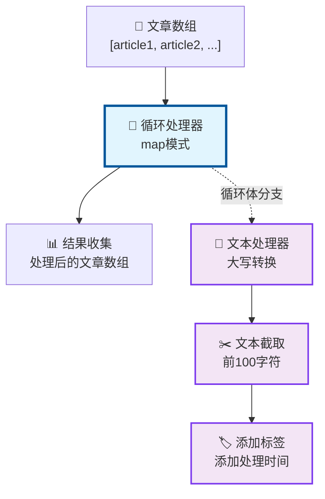
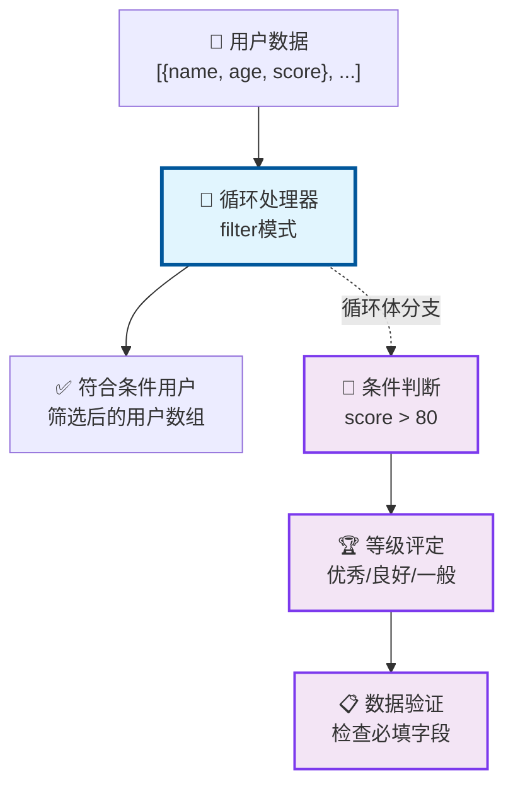
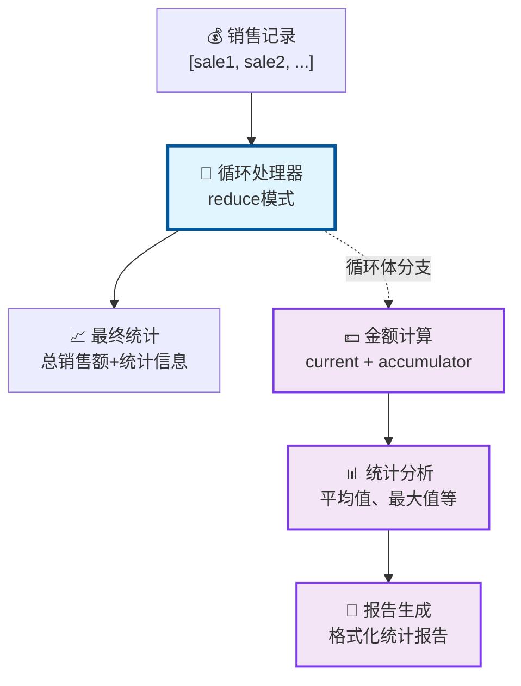

# 循环体分支功能演示 🎯

## 🚀 功能概览

v2.0 版本引入了革命性的**循环体分支**功能，让您可以在工作流中创建复杂的循环处理逻辑。不再局限于简单的表达式，您可以连接整个节点分支作为循环体！

## 📖 基础使用指南

### 1. 创建循环体分支

#### 步骤1：添加循环节点
```
拖拽 "循环处理器" 节点到画布
```

#### 步骤2：连接数据源
```
数据源节点 → 循环处理器（右侧连接点）
```

#### 步骤3：连接循环体分支
```
循环处理器（下方紫色连接点）→ 循环体节点
```

#### 步骤4：连接输出节点
```
循环处理器 → 后续处理节点
```

### 2. 可视化识别

- **🔵 蓝色实线**: 数据流连接
- **🟣 紫色虚线**: 循环体分支连接，带有 "循环体" 标签
- **🟣 紫色连接点**: 位于循环节点下方，用于连接循环体分支

## 🎨 实战演示案例

### 案例1: 文本处理流水线

**场景**: 对文章数组进行批量文本处理



**循环体节点接收的数据**:
- `element`: 当前文章内容
- `index`: 文章在数组中的位置
- `array`: 完整的文章数组

**处理结果**: 每篇文章经过"大写转换 → 文本截取 → 添加标签"的完整流水线处理

### 案例2: 条件数据筛选

**场景**: 对用户数据进行条件筛选和标记



**筛选逻辑**: 只有经过完整分支处理且返回 `true` 的用户才会被保留

### 案例3: 数据累积计算

**场景**: 计算销售数据的累积统计



**特殊处理**: reduce模式下，循环体分支接收 `{element, accumulator}` 作为输入

## 🎯 高级使用技巧

### 1. 智能处理策略

#### 表达式 vs 分支选择
```javascript
// 简单处理 → 使用表达式
element => element.toUpperCase()

// 复杂处理 → 使用分支
数据验证 → 格式转换 → 业务逻辑 → 结果封装
```

#### 最佳实践
- **简单变换**: 优先使用表达式，性能更好
- **复杂逻辑**: 使用分支，逻辑更清晰
- **可维护性**: 分支模式便于调试和修改

### 2. 循环变量的巧妙应用

#### 在文本处理中使用索引
```javascript
// 循环体中可以访问 index 变量
`${element} (第${index + 1}项)`
```

#### 在条件判断中使用数组信息
```javascript
// 可以访问完整的 array 进行上下文判断
if (index === 0) {
    // 第一项特殊处理
} else if (index === array.length - 1) {
    // 最后一项特殊处理
}
```

### 3. 错误处理策略

#### 配置错误处理选项
- **遇错中断**: 开启后，单个元素处理失败会停止整个循环
- **继续处理**: 关闭后，错误元素会被跳过，继续处理后续元素
- **错误收集**: 在循环结果中可以查看所有错误信息

#### 调试技巧
1. **逐步调试**: 先创建简单的循环体分支，确保基本逻辑正确
2. **日志输出**: 在循环体节点中添加日志输出，观察数据流
3. **小批量测试**: 使用小数组进行测试，避免大量数据干扰

## 📊 性能优化建议

### 1. 数组大小控制

#### 设置合理的迭代上限
```javascript
// 大数组处理建议
maxIterations: 1000  // 防止浏览器卡顿
```

#### 分批处理策略
```javascript
// 对于超大数组，考虑分批处理
array.slice(0, 1000)  // 先处理前1000项
```

### 2. 循环体优化

#### 避免重复计算
```javascript
// ❌ 错误：在循环体中进行重复计算
const expensiveResult = heavyCalculation(data);

// ✅ 正确：将计算提取到循环外
// 在循环前节点中进行计算，结果传递给循环节点
```

#### 减少节点层数
```javascript
// 简单的循环体分支更高效
数据输入 → 处理 → 输出
// 比深层嵌套的分支性能更好
```

## 🔍 故障排查指南

### 常见问题解决

#### 问题1: "循环体分支未执行"
**症状**: 循环正常运行，但分支逻辑没有生效
**解决**: 
- 检查紫色连接线是否正确连接
- 确认连接是从下方紫色连接点发起的
- 查看连接是否显示"循环体"标签

#### 问题2: "循环变量无法访问"
**症状**: 在循环体分支中无法获取 element、index 等变量
**解决**:
- 确认节点已正确标记为循环体节点
- 检查节点的参数配置是否正确
- 验证循环上下文是否正确传递

#### 问题3: "性能问题"
**症状**: 大数组处理时浏览器卡顿或崩溃
**解决**:
- 降低 maxIterations 设置
- 简化循环体分支逻辑
- 考虑使用表达式替代复杂分支

### 调试清单

- [ ] 连接线颜色和样式正确（紫色虚线）
- [ ] 连接标签显示为"循环体"
- [ ] 循环节点配置正确
- [ ] 数组数据格式正确
- [ ] 循环体分支逻辑验证通过
- [ ] 错误处理配置合理

## 🎉 总结

循环体分支功能为工作流编辑器带来了质的飞跃：

### 🚀 核心优势
1. **表达能力**: 从简单表达式扩展到复杂分支逻辑
2. **可视化**: 清晰的紫色分支连接，逻辑一目了然  
3. **灵活性**: 表达式和分支两种模式智能切换
4. **可维护性**: 分支逻辑便于调试和修改

### 💡 应用场景
- **数据清洗**: 复杂的数据验证和转换流程
- **业务处理**: 多步骤的业务逻辑处理
- **报表生成**: 数据统计和报告生成流水线
- **内容处理**: 文本、图片等内容的批处理

### 🔮 发展空间
随着您对循环体分支功能的深入使用，您会发现它为复杂业务逻辑的可视化实现提供了无限可能！

---

**开始您的循环体分支之旅吧！** 🎯✨
