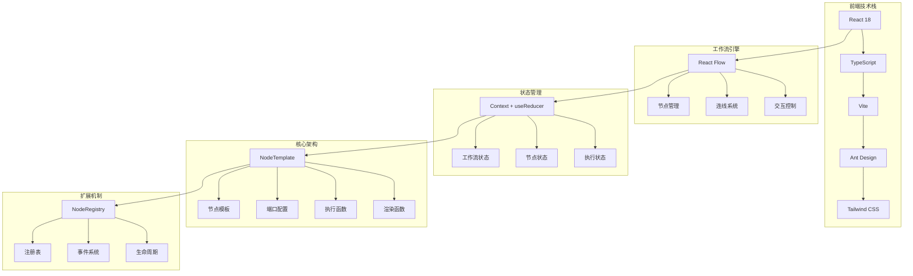
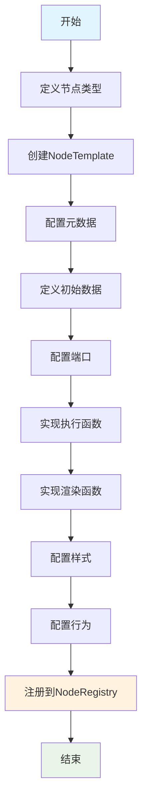
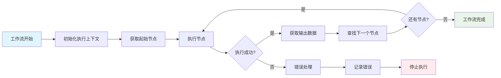
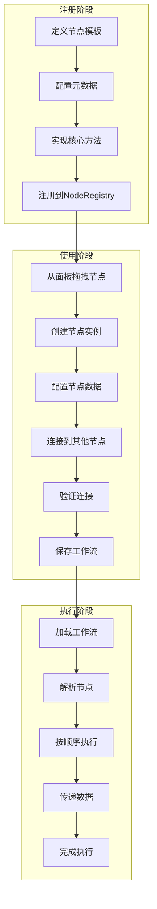
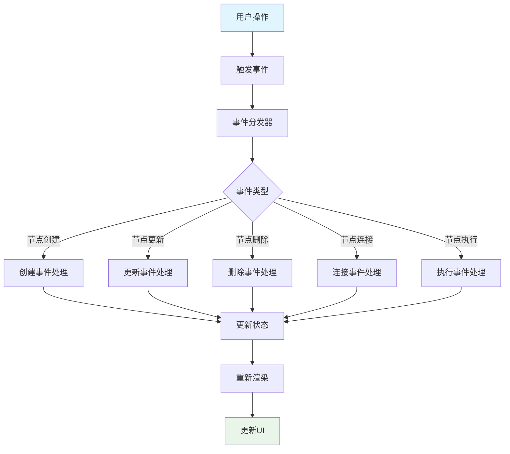
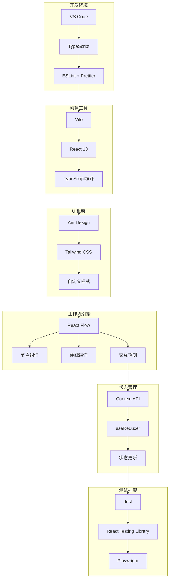
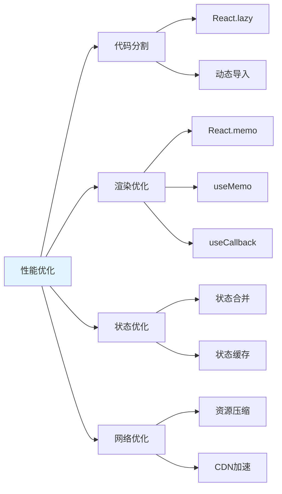
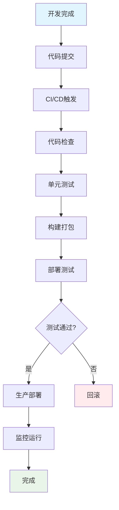
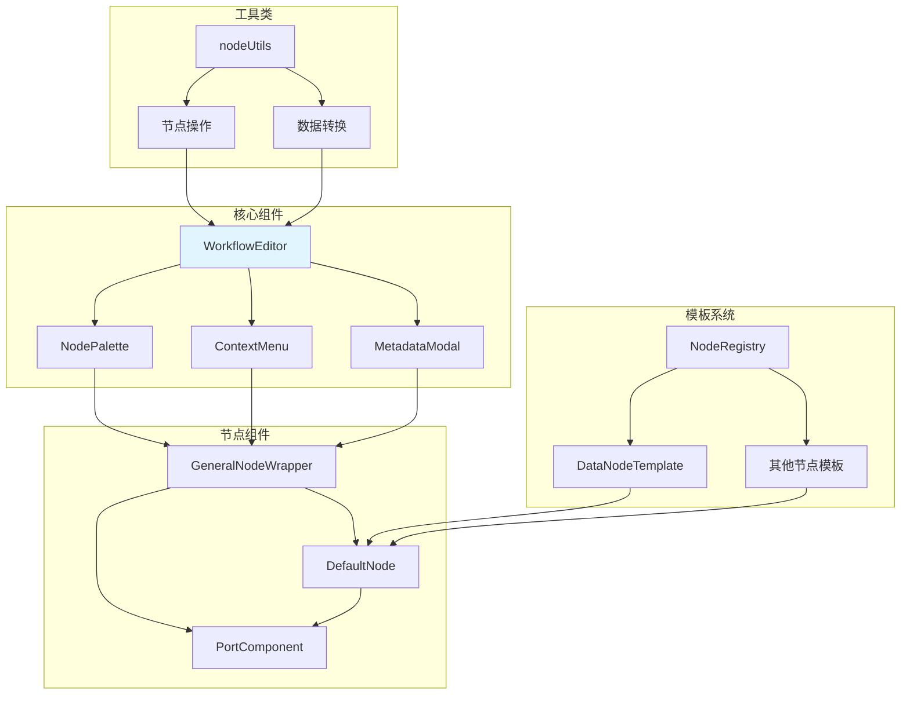

# 工作流编辑器系统流程图

## 1. 整体系统架构图

## 2. 节点模板设计流程图

## 3. 工作流执行流程图

## 4. 节点注册和使用流程图

## 5. 数据流图

## 6. 事件系统流程图

## 7. 技术选型关系图

## 8. 性能优化策略图

## 9. 部署流程图

## 10. 系统组件关系图

## 总结

这些流程图展示了工作流编辑器系统的完整架构，包括：

1. **技术栈选择** - React 18 + TypeScript + Vite + Ant Design
2. **核心设计** - 模板化节点系统，类型安全
3. **执行流程** - 从节点注册到工作流执行
4. **数据流** - 节点间的数据传递和处理
5. **事件系统** - 组件间的解耦通信
6. **性能优化** - 多层次的优化策略
7. **部署流程** - 完整的CI/CD流程

整个系统设计遵循了模块化、类型安全、可扩展性的原则，为后续的功能扩展和维护提供了良好的基础。 